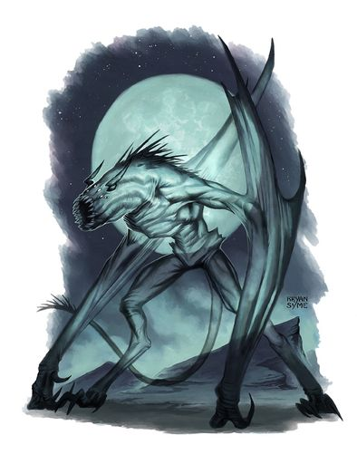
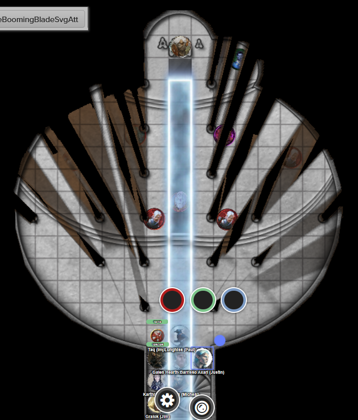

# 2 Sep 2026

**[Previously](2026-08-26.md):** We have cleared Baron Thutin's castle of his forces, and rescued Edmund, the son of the rightful baron. However, Thutin himself has escaped. We held a council with Edmund, Ixona, the dwarven blacksmith, and Father Bellerone, while Taq scouted the retreating enemy. To aid us, the baron gave us a mimir that has been in his family for generations. The mimir identified some enemy artifacts we found, such as midnight stones and bones of creatures from the Void. We headed to The Court of the Lunar Knight, where we believe Thutin has fled. On the ground floor of this ivory tower, we first battled with some elvish-looking defenders. On the second floor, we found a grassy field with pavilions, and three knights who offer to joust volunteers from our party. Barrisso, Galen and Gralok accept their challenge, and Barrisso wins the contest on points. The knights guide us to the next floor, warning "Don't drink from the new moon fountain"...

---

We arrive into a short pillared hallway. A wide balcony overlooks a temple-like building. Stairs lead down to a white marble floor with a pool set into it. A disc is mounted on the wall behind it.

As soon as they hear us coming, some bat-like transparent creatures turn to look at us:

<figure markdown>
  
  <figcaption>Bat-like Creatures</figcaption>
</figure>

Gralok rages and runs towards them. His first attack misses, but his second attack does 12HP of damage plus 12HP of psychic damage via Infectious Fury.

Norgreath casts Eldritch Blast with Agonizing Blast and Genie's Wrath at the same target, doing 21HP damage. He casts three more attacks, doing 67HP in total.

<figure markdown>
  
  <figcaption>Court of the Lunar Knight - Third Floor</figcaption>
</figure>

Karthis casts Haste on Gralok.

One of the bat-like creatures hurls moonlight at Norgreath, doing 11HP of cold damage but also blinding him.

Another attacks Gralok with a claw, doing 5HP of slashing damage.

A third creature turns invisible.

The next enemy hurls moonlight at Norgreath, hitting for 6HP of cold damage.

The final creature flies over to Norgreath and attacks with his fangs and claws, but misses.

Lunghiss casts Shadow Blade at 2nd level and attacks, doing 71HP of damage. As his shadow blade pierces the creature, he senses the creature is resistant to a lot of damage.

Ixona casts Fire Bolt at one of the creatures, doing 20HP of fire damage.

Barrisso moves in and attacks with his Fool's Shortsword; his damage causes it to howl, which reminds him of the howl of a wolf to the moon. Barrisso attacks again with his shortsword and scimitar, killing it. Barrisso jumps down to the main floor.

Galen casts Sacred Flame, doing 16HP of fire damage.

---

Gralok attacks the creature north of him, doing 15HP of damage.

Norgreath uses Taq's eyes to guide his attacks. He attacks the creature beside Gralok at disadvantage, doing 63HP of damage, killing it.

Karthis casts Chain Lightning at one of the creatures. Two more missiles shoot out at the other visible creature, doing a max of 34HP of damage.

One of the creatures steps into a moonbeam and teleports directly to Karthis. He hurls moonlight at him, doing 42HP of damage and blinding him.

The invisible enemy hurls moonlight at Barrisso, doing 40HP of damage (but not inflicting blindness on him).

The third bat-like thing hurls moonlight at Galen, doing 20HP of cold damage but again not blinding him.

Lunghiss attacks the creature that teleported doing 37HP of damage (plus 16HP of thunder damage if it moves).

Ixona casts Shocking Grasp on the same target, killing him.

Barrisso attacks the invisible creature beside him, using Divine Smite to add more damage. That kills him. Barrisso moves to the last creature and attacks with shortsword and scimitar.

Galen casts Sacred Flame, doing 23HP of fire damage.

---

Gralok slams his Blazing Cold Greataxe into the same target, killing him.

---

Galen spends ten minutes casting Prayer of Healing on the party, giving everyone 23HP of healing back.

Meanwhile, the waxing crescent on the wall expands to become a half moon, then gibbous moon, then a full moon, then back again.

We ascend the stairs to the fourth floor. We are on grass again, surrounded by thick hedges. A gibbous moon hangs above. There are another set of stairs, but blocked off by a gate. We appear to be in some kind of maze.

<figure markdown>
  
  <figcaption>Court of the Lunar Knight - Fourth Floor</figcaption>
</figure>

Barrisso tries to fly up for a view. As soon as he tries, he is teleported back to the stairway. We forward, then turn right. We continue to follow the maze, looking for anything of significance. We find ourselves at a dead end with an oblong reflecting pool. There is also a bush bearing plump round berries. Barrisso plucks a berry and throws it into the pool. Nothing seems to happen. He tries to detect magic and senses magic from everywhere, including the berries and pool.

He tries one of the berries. It is incredibly tart. But otherwise, no effect.

We continue through the maze. We find two rows of fruit trees, laden with plums, pears, and apples. Barrisso picks an apple. It seems to be just a nice apple.

Gralok tastes a pear. It's very nice.

Norgreath samples a plum. Again, very tasty.

We continue on to find a corridor of eight statues. They look like pairs of fey creatures facing each other. Each have arms raised with batons held aloft like an honour guard.

We move away into a clearing with several small bushes and a small hillock topped with a tree. There is a small well under the tree. Barrisso notices a sign on the side of the well in a script he cannot read, but which Karthis understands as Sylvan. It says "WISHING WELL".

Barrisso throws a gold coin into the well. He wishes to be immune to fire damage. He is suddenly doused, as if four gallons of water were dropped on his head.

As we move away from the well *(Wisdom Save)* we all have a very strong urge to look at our Deck of Many Things. But we all resist the urge.

We move again, this time to another clearing with shrubs surrounding a circular marble fountain, with water arcing into the air. We realise *(Wisdom Save)* is having a soporific effect on us, and might have lulled us to stay here and not move on. We move on.

Beyond the fountain is a hedge with a satyr's carved face spitting water into a stone basin. There is a black onyx disc embedded into the side of the basin. Barrisso senses it is magical of type Transformation. We walk past it and continue on.

At another dead end is a similar fountain except that the stone disc is white onyx.

We continue on into another small clearing through an archway. It contains a round reflecting pool with three marble benches around it. There is a Sylvan inscription carved into the pool: "TAKE JOY IN THE MEMORY LEFT HERE, OR UNBURDEN YOURSELF OF YOUR OWN".

Barrisso sits on the bench and looks at the pool. Suddenly, he remembers charging at the red knight whose lance pierces your skull. Then he feels nothing. He blinks, and the pool is there again.

Karthis tries gazing at the water too. Suddenly he remembers endlessly falling and hitting dark wet stone.

Lunghiss also tries. He remembers pulling on something, a damp rope, which he is pulling, pulling, a scraping sound, and suddenly a bucket appears at the top of the well and spills on the ground.

Galen follows suit. Suddenly, he remembers being in a cavern with dripping stalactites and stalagmites obscuring his view. He sees tentacles from the largest stalactites, grabbing him and pulling him towards them.

We move on. We find another dead end with a statue of a male fey in robes with a disapproving look. One of his hands strokes his carved beard. Barrisso detects magic of the school of Alteration.

We follow the right hand wall back to where we started, then continue to explore, hugging the left hand wall. We enter another clearing with a wooden planter box in its centre. A bush of plumb black berries grows in the box. We don't recognise the berries but detect they are magical. Barrisso plucks a berry, and gains 1HP. He also feels satiated. The rest of us try the berries and similarly gain a hit point and feel full.

After more exploring, we find a passageway that lets us access the stairwell going upwards. Before we ascent, we search the remainder of the maze. We find a glass coffin surrounded by flowering shrubs. In the coffin is a beautiful fey maiden.

We are *(Wisdom Save)* overcome by a feeling of sadness. We feel that it might have completely overwhelmed us.
We check the coffin and it appears not to be sealed. We all try to lift the lid. As we do, we are teleported back to the start of the maze (apart from Taq).

We resume our journey back through the maze to the staircase up. It is surrounded by four shrubs and two benches. We ascend the stairs.

---

We find ourselves in a round room with numerous pillars. A black carpet leads up to a raising dais with a throne lit by braziers. Soft music is playing from an unknown source, covering the din of multiple voices. But we only see nine figures here. It looks as if the Baron Thutin is sitting in the throne, flanked by his archmage and an imposing fey woman dressed in finery. Four fey soldiers in light armour, plus two other beings. One is armed and armoured, the other looks as if carved from reddish stone and holds a stone staff with a strange emanation from it to his other hand. Another fey lady wears green armour.

<figure markdown>
  
  <figcaption>Court of the Lunar Knight - Fifth Floor</figcaption>
</figure>

The baron's archmage moves and casts Lightning Bolt at the whole party (apart from Barrisso), doing 20 or 40HP of damage. Taq is down.

"BEGONE FROM THIS PLACE! THE HERALD WILL NOT BE DISTURBED!"

The statue-like enemy floats towards us, looks at Lunghiss and fires two necrotic rays at him, doing 24HP of damage.

Barrisso flies over the archmage, then casts Destructive Wave at all the enemies. Three are knocked to the ground, while all take damage. Barrisso continues flying and hovers next to the baron.

Gralok rages and attacks the stone guy twice with his greataxe, but feels it is not doing full damage. He inflicts 18HP of psychic damage with Infectious Fury.

One of the fey women (Lady Ruth, the River Knight) casts Flood Blast at Barrisso but misses. He follows up with two longsword attacks. One hits for 16HP of slashing/lightning damage. She calls to the baron: "Withdraw, my lord!". He moves away from Barrisso.

One of the fey soldiers gets up from the ground and moves. He flings his dagger at Gralok, doing 8HP of piercing damage.

Another fey soldier gets up from being knocked prone and charges, then does a rapier attack on Gralok.

The next two fey soldiers fall back to guard the baron...
