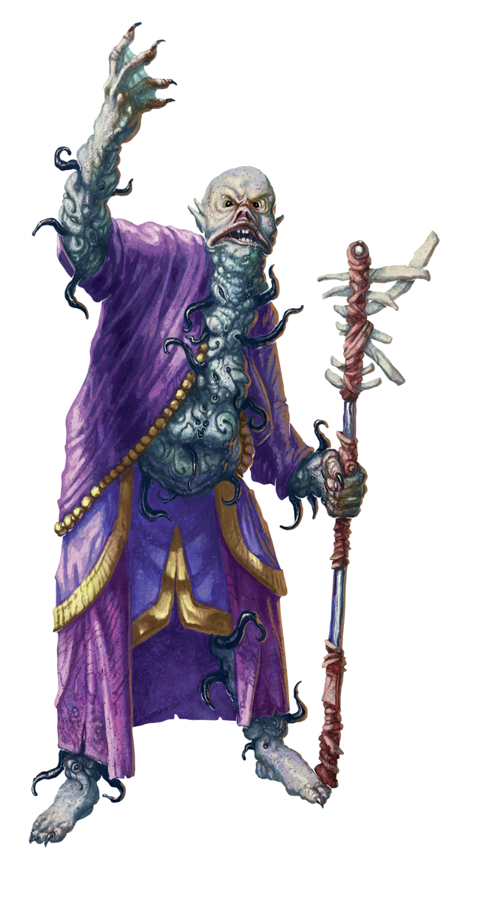

# 9 Sep 2026

**[Previously](2026-09-02.md):** We cleared Baron Thutin's castle of his forces, and rescued Edmund, the son of the rightful baron. However, Thutin himself has escaped. We held a council with Edmund, Ixona, the dwarven blacksmith, and Father Bellerone, while Taq scouted the retreating enemy. We headed to The Court of the Lunar Knight, where we believe Thutin has fled. We made our way to its third level and fought some unknown bat-like creatures. Then, on the fourth level, we navigated through a hedge maze to the level above. Finally, we found the ex-Baron Thutin and his minions. His archmage attacked us, and the battle is on...

---

Lady Morgant casts Moon Bolt at Barrisso but misses.

Norgreath attacks one of the mages with Eldritch Blast with Agonizing Blast and Genie's Wrath, doing 32HP.

Ixona throws her orb towards the enemy, but they manage to avoid it.

Karthis throws a Fireball at a group of enemies to the north-east, doing a max of 40HP of fire damage.

Lunghiss casts Shadow Blade, moves and attacks the statue-like enemy, doing 82HP of damage, killing him. He then moves away.

Lady Morgant casts Moonbeam which lances down at Lunghiss, doing 49HP of radiant damage. Or would have, but Lunghiss uses Spell Thief to negate the damage from the spell and steal it from her.

Galen casts Toll the Dead at the mage in the centre of the room, doing 41HP of damage.

---

The mage in turn casts a spell that causes a magical darkness that slowly fills the whole chamber. All light has gone from the chamber, and darkvision no longer works. We start to hear shrieks and gibbering and mad laughter from all around us. Karthis recalls a spell called Maddening Darkness that matches this effect.

Barrisso *(Wisdom save)* takes only half the psychic damage inflicted by this maddening cloud. He attacks Lady Ruth, doing 31HP of damage.

Gralok *(Wisdom save)* takes 32HP of psychic damage from the darkness, then attacks and wounds a shadow fey soldier, despite being blinded.

Lady Ruth attacks Barrisso with her longsword, doing 30HP of damage. She then casts Flood Blast at him, doing 14HP of bludgeoning damage, but does not knock him down.

Lady Morgant seems to teleport towards Karthis and attacks him with her rapier and dagger, doing 57HP of damage.

Norgreath *(Wisdom save fail)* suffers 28HP of damage. He casts Armor of Agathys, then moves to the wall to retrace his steps back to the entrance.

Lady Morgant uses a Flashing Blade Dance on Karthis and Norgreath. Norgreath and Karthis both suffer 14HP of damage.

Karthis *(Wisdom save)* takes 21HP of damage from the maddening darkness. Karthis casts Dispel Magic at ninth level.

Lunghiss moves and sneak attacks Lady Morgant with his Shadow Blade, doing 70HP of psychic/thunder damage (plus 13HP is she moves). She is still alive, but looks shook. Lunghiss retreats back to where he was.

Galen casts Sunbeam at four of the opponents, doing 27HP of radiant damage and blinding them.

---

Thutin calls out "Kill that man!": one of his fey duellist minions flings a dagger at Galen. He takes 6HP of damage, but saves from poison.

The enemy archmage casts a series of Arcane Bursts: one hits Barrisso, doing 19HP of force damage.

Barrisso casts Misty Step to the blinded archmage and attacks but misses.

Gralok attacks the archmage, striking him down. As he falls to the ground, his robes fold and his body collapses. Out of the robes rises a huge worm-like creature with a tentacled face, so huge that both Barrisso and Gralok are pushed out of its space.

As this beast appears, the room and indeed the whole building vibrate, as if reality itself is bending...

Lady Ruth calls out. "Heralds! The next sign of the comet has come as planned! Hold your course!". She attacks Karthis with her rapier and dagger. He deflects one attack but the dagger hits him. Karthis is down.

Thutin is still blinded by Galen's Sunbeam.

A shadow fey duellist moves to attack Galen with his rapier, wounding him with 24HP of damage.

Another attacks Norgreath, doing 16HP damage but also suffering damage himself from Norgreath's Armor of Agathys.

A shadow fey dualist attacks Barrisso with rapier dagger attack. All attacks hit, and Barrisso falls.

Another shadow fey dualist hits Norgreath once and misses twice, and takes 25 cold damage in return.

Lady Morgant hits Norgreath with rapier and dagger. His armour hits back the first time with a 25 cold damage. Norgreath is down to 14 HP.

Norgreath grabs Karthis and uses Thunder Step to escape, doing 40HP of thunder damage in the area where he leaves. Lady Morgant and a shadow fey duellist die, but are seemingly transformed into something, creatures from the Far Realm...

Ixona runs towards Thutin, trying to damage him with her sphere, doing 21HP of damage.

Karthis succeeds his death save.

Lunghiss moves and sneak attacks Thutin with his Shadow Blade, doing 69HP of psychic/thunder damage, plus 14HP of thunder damage if he moves.

Galen casts Mass Heal. Barrisso and Karthis are completely healed, and the rest of the party are restored to full health. Both Karthis and Barrisso however are suffering from exhaustion.

The giant worm-like creature bites Gralok, doing 10HP of piercing damage and grappling him. It then attacks with its tendrils, wounding him.

---

Barrisso is still on the ground, and attempts to banish the gigantic worm spawn with Banishment. Unfortunately the creature saves. He then attacks the fey duellist next to him with his scimitar but misses.

Gralok frees himself from the creature's grapple, then uses his Ring of the Ram against Thutin but misses.

Lady Ruth uses her Grasping Whirlpool power on Gralok, Karthis and Norgreath. They all avoid being trapped in the whirlpool.

Thutin attacks Barrisso with a great sword, but misses.

A shadow fey duellist attacks Galen with rapier and dagger, doing 15HP of damage.

The transformed Lady Morgant attacks Galen with two Psychic Orbs, but both miss. As she moves, the floor and pillars seem to shift around her.

<figure markdown>
  
  <figcaption>Lady Morgant Transformed</figcaption>
</figure>

A shadow fey duellist attacks Ixona with rapier and dagger: all attacks hit, doing 41HP of damage and is poisoned.

Another shadow fey duellist attacks Barrisso, doing 22HP of damage.

Another transformed opponent moves and uses its Collapse Distance ability to warp space on Norgreath. Norgreath is teleported right beside the giant worm. Karthis takes 45HP of psychic damage as he was in the space Norgreath was teleported from.

Norgreath casts Banishment on two creatures: the giant worm and a star spawn seer are both banished.

Ixona attacks a shadow fey duellist with her sphere.

Karthis attacks a shadow fey duellist with Poison Spray, doing 24HP of poison damage.

Lunghiss attacks Thutin, doing 68HP of damage, plus 18HP if he moves.

Galen casts Sunbeam on a shadow fey duellist and transformed being, [doing 9HP of radiant damage to each...](2026-09-16.md)
