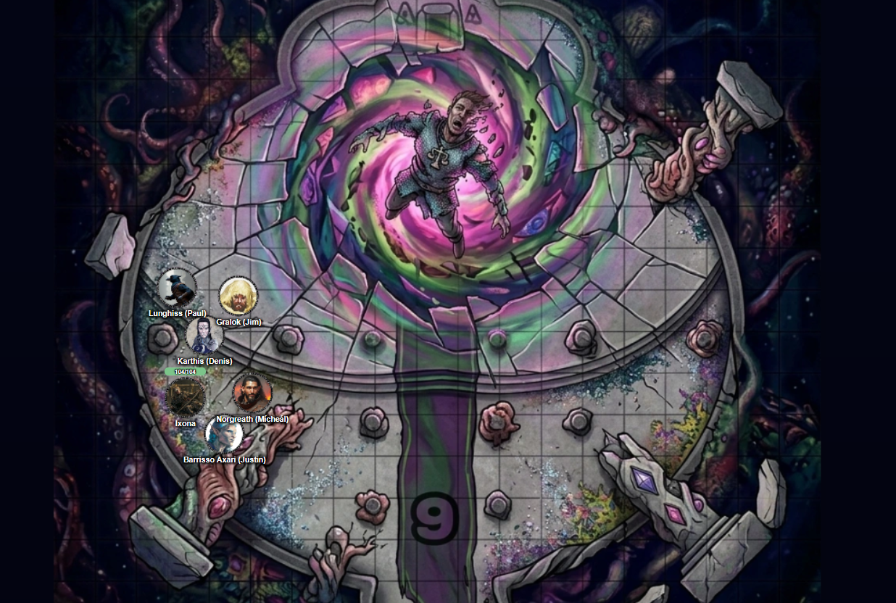

# 30 Sep 2026

**[Previously](2026-09-23.md):** We cleared the baronial castle of Thutin and his forces, and tracked him down to The Court of the Lunar Knight. A gruelling battle took place in which our opponents, when felled, revived as bizarre, sometimes gigantic, creatures from the Void. During the battle, Galen and Norgreath managed to banish some of our enemy. But once four of our party were down, we realised we had to retreat. Norgreath managed to Plane Shift all but Galen and Taq back to Elturel. We interrogated Ixona, but she seemed innocent of the ruse that Thutin and his comrades seem to have played on us. We realised we had to go back to her world, if only to rescue Galen. After two long rests to recuperate, Norgreath used his magic coin to guide us back to K'thar. There, Taq scouted ahead and found that the baronial castle has already been assaulted by these Void creatures, with broken gateways and walls and bodies strewn everywhere. Norgreath tried to locate Void Thutin using Scrying, and was suddenly attacked psychically...

---

Taq searches the castle top to bottom, but finds no living being among the few dead left behind. He checks the treasure room, but it's locked. Gralok searches the tracks outside (*Survival check*) but cannot determines whether anyone left recently and in which direction. He looks up briefly into the sky which begins to splinter, like shattered glass, to be replaced by impossible colours that are burning his eyes. Rain of some sort begins to fall - but upwards.

Norgreath decides to interrogate one of the dead bodies using Speak with Dead.

"The last time were here to help restore the baron, were you here?"

"Yes."

"How long after that was the castle fell?"

"Just days."

"Exactly long ago was that?"

"Just days."

"Did anyone survive?"

"Not me!"

"How big was the host of the enemy?"

The corpse pauses.

"Uhh.. I didn't see them all."

He dies.

---

We decide to head back to the The Court of the Lunar Knight to recover and restore Galen. We travel across what we thought would be familiar territory, but find it has changed into a nightmare. Trees now have human eyes which blink at us. Forest animals have merged into composite chimeras. At the end of the first day we camp, and set up a watch, while Norgreath casts Heroes' Feast (giving us 12HP), while Karthis casts Tiny Hut.

During the night we see strange things happen in the vicinity, but nothing immediately threatening. We awake in the morning, rested.

As we travel, boulders and ancient trees free themselves from the earth and rise up towards the sky. That sky reminds me of the plane of the Blade we visited: as if everything around us is being drawn up into a vortex. As we continue on the path, the whole day and night cycle seems to skip, as if time is passing more quickly, then stopping. We see ghostly echoes of people who might have passed our way, disappearing then reappearing. We hear an echo of Galen's voice calling out to us. Suddenly we realise that four days have passed since we slept (and our additional 12HP are gone).

---

We find ourselves at The Court of the Lunar Knight. The bottom portion is completely gone: hovering in the sky 50 feet above us are the remnants of a tower. The upper section is being syphoned off into a gaping rift in the inky tentacle-fringed blackness of the sky.

Those who can fly (Barrisso, Norgreath, and Lunghiss with his Cloak of the Bat) fly up as fast as he they can.

<figure markdown>
  
  <figcaption>Disintegrating Tower</figcaption>
</figure>

Eighty feet above the level of the tower's floor, right in the middle of the Void space hangs Galen's body, with black oozy tentacles grasping him. He seems not wholly dead or alive but is being slowly disintegrated.

Barrisso flies up and tries to grab him, but is teleported back (*Arcana check fail*) to the level of the tower. He casts Dimension Door to position himself beside Galen. He finds he just lands back on the ground. He tries again but fails. He tries a third time, and again fails.

Norgreath casts Thunder Step in order to reach Galen. He manages (*Arcana check success*) to reach Galen's body which is hovering near the Void. As soon as he does so, he senses a presence. He is attacked by several tendrils, taking a massive 99HP of damage. This must be the Void Lord, formerly Thutin.

From the floor below, the party have seen Norgreath being attacked by tentacles, but we don't see any other creatures at this time.

Norgreath's simulacrum (who has accompanied us from Elturel) casts Heal.

Gralok rages and then applies Call the Hunt. He then attacks some of the tentacles which descend to our level. His blazing cold greataxe bites into them, doing 19HP of damage.

Taq flies over to the far side of the Void Lord to keep Norgreath informed of is happening.

Lunghiss casts Shadow Blade, moves and attacks. His blade bites deep, but the shadowy blade forms its own shadowy tentacle which does 36HP of damage, and also grapples him.

Karthis casts Haste on Gralok.

Norgreath tries to grab Galen's body and use Thunder Step to get back to the ground. But Galen is connected to the Void Lord's tentacles. When he tries to Thunder Step down, he finds he cannot perform it. He is also attacked for 34HP of bludgeoning damage.

Ixona is horrified by this creature, but casts Death God's Touch on a tentacle, doing 50HP of necrotic damage.
That tentacle shrivels away, freeing Lunghiss. However, there appears to be another three of them.

One of those tentacles attacks Norgreath, doing 89HP of damage.

Barrisso attacks a tentacle with his Fool's Shortsword, doing 35HP of damage. His second attack misses. He uses his last Luck point to re-attack, doing 33HP of damage. Finally, his offhand attack does 46HP of damage. His flurry of attack destroy another tentacle.

Norgreath's simulacrum attacks with Eldritch Blast with Agonizing Blast and Genie's Wrath, but none of his damage connects.

Gralok activates his blazing cold greataxe, doing 66HP of damage to.

Lunghiss performs a sneak attack on the damaged tentacle with Lathander's blade, and it shrivels up. One tentacle is left.

Karthis casts Last Rays of the Dying Sun at all creatures within range.

Norgreath casts Thunder Step to free himself from a tentacle's grapple, but still cannot move from the tentacle.

Ixona throws her orb of annihilation.

Barrisso attacks with his Fool's Shortsword but they all miss.

Norgreath's simulacrum targets the remaining tentacle with Eldritch Blast with Agonizing Blast and Genie's Wrath, doing 42HP of damage.

Gralok is once again targetted by Void Thutin with a desire of Insatiable Hunger, and bites Lunghiss for 59HP of damage.

Lunghiss moves and Gralok with his Sentinel ability gets an attack of opportunity that misses Lunghiss.

Lunghiss sneak attacks with his Lathander's Blade and destroys the last tentacle. Galen is now floating freely.

Karthis casts Circle of Death straight up at the emanation of the Void Lord. But the target seems to take no damage at all.

Norgreath grabs the body of Galen, then casts Plane Shift. They pop out of existence.

Ixona moves her sphere towards the Void Lord but seems to do no damage.

The Void Lord moves towards Norgreath's simulacrum and attacks, doing 99HP of damage; he's dead.

Barrisso moves and pushes Lunghiss away from Gralok's ravenous attention and heals him for 70HP.

Gralok attacks Ixona, biting her severely.

Taq stings the Void Lord.

Lunghiss does a Bloodfuelled Sword attack, doing 120HP plus 14 if he moves. He then retreats, having suffered 57HP of damage himself.

Karthis casts Lightning Bolt at the behemoth, doing some damage.

Ixona moves away from Gralok, avoiding taking an attack of opportunity by performing Misty Step. She then casts Fire Bolt at the enemy.

The Void Lord attacks and wounds both Barrisso and Ixona.

Barrisso attacks it with his Fool's Shortsword; he misses, but connects with his scimitar, [doing (with Divine Smite) 29HP of damage...](2026-10-07.md)
