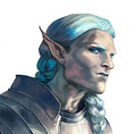
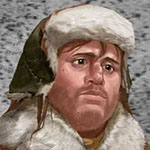
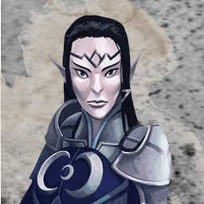
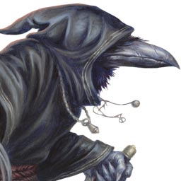

# The Party

- [Barrisso](#barrisso): Eladrin paladin
- [Galen](#galen): Human cleric of Order
- [Gralok](#gralok): Human barbarian
- [Karthis](#karthis): High elf wizard (war mage)
- [Lunghiss](#lunghiss): Kenku Arcane Trickster rogue
- [Norgreath](#norgreath): High half-elf warlock

## Barrisso

<figure markdown>
  { width="150" }
  <figcaption>Barrisso</figcaption>
</figure>

- [Barrisso Axari](https://www.dndbeyond.com/characters/110850067)
- Justin
- Male
- [Eladrin](http://dnd5e.wikidot.com/lineage:eladrin)
- [Paladin](http://dnd5e.wikidot.com/paladin)

## Galen

<figure markdown>
  { width="150" }
  <figcaption>Galen</figcaption>
</figure>

- [Galen Hearthcomb](https://www.dndbeyond.com/characters/110980886)
- Eamon
- Male
- [Human](http://dnd5e.wikidot.com/human)
- [Cleric](http://dnd5e.wikidot.com/cleric): [Order Domain](http://dnd5e.wikidot.com/cleric:order)

## Gralok

<figure markdown>
  { width="150" }
  <figcaption>Gralok</figcaption>
</figure>

- [Gralok Rua](https://www.dndbeyond.com/characters/110980094)
- Jim
- Male
- [Human](http://dnd5e.wikidot.com/human)
- [Barbarian](http://dnd5e.wikidot.com/barbarian): [Path of the Beast](https://dnd5e.wikidot.com/barbarian:beast)

## Karthis

<figure markdown>
  { width="150" }
  <figcaption>Karthis</figcaption>
</figure>

- [Karthis](https://www.dndbeyond.com/characters/110952593)
- Denis
- Male
- [High Elf](http://dnd5e.wikidot.com/elf#toc4)
- [Wizard](https://www.dndbeyond.com/classes/wizard): [War Magic](https://dnd5e.wikidot.com/wizard:war-magic)

## Lunghiss

<figure markdown>
  { width="150" }
  <figcaption>Lunghiss</figcaption>
</figure>

- [Lunghiss](https://www.dndbeyond.com/characters/110954313)
- Paul
- Male
- [Kenku](http://dnd5e.wikidot.com/kenku)
- [Rogue](http://dnd5e.wikidot.com/rogue): [Arcane Trickster](https://dnd5e.wikidot.com/rogue:arcane-trickster)

## Norgreath

<figure markdown>
  { width="150" }
  <figcaption>Norgreath</figcaption>
</figure>

- [Norgreath](https://www.dndbeyond.com/characters/99951788)
- Michéal
- Male
- [High Half-Elf](http://dnd5e.wikidot.com/half-elf)
- [Warlock](http://dnd5e.wikidot.com/warlock)
